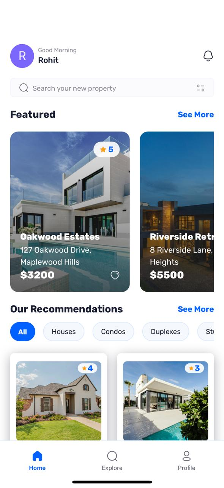
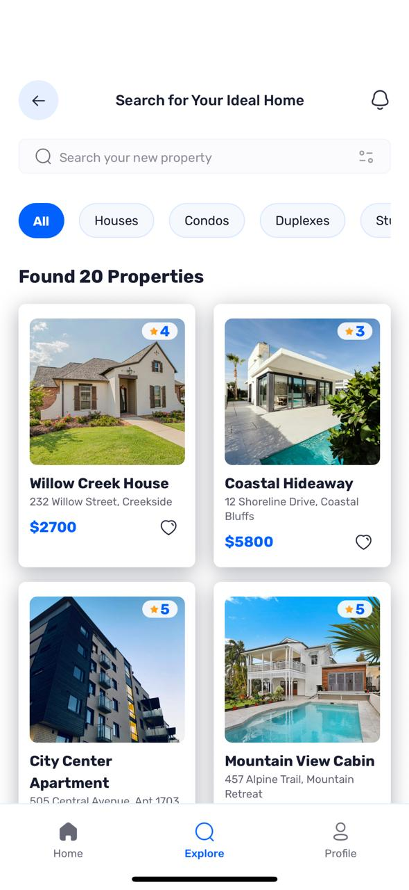
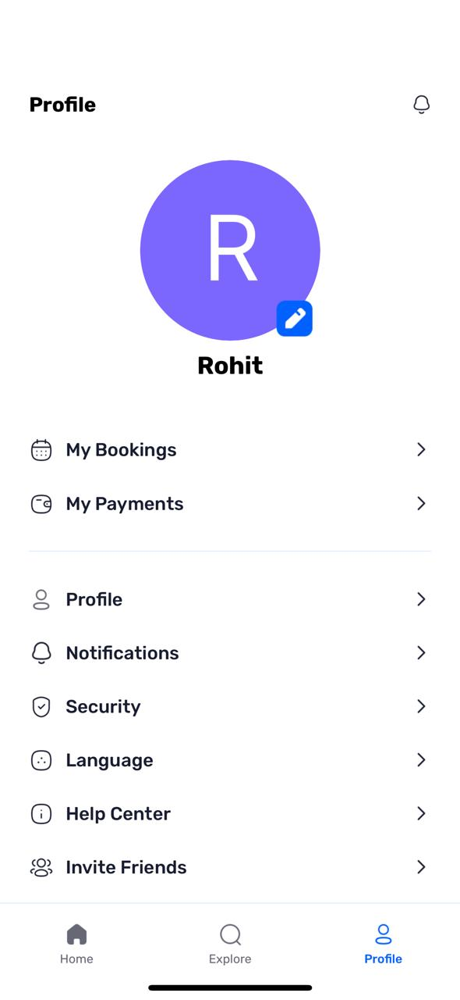
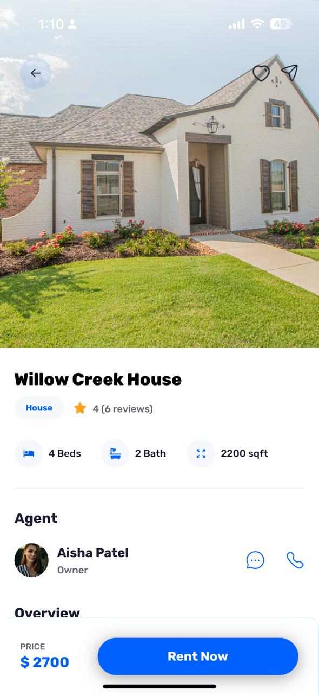
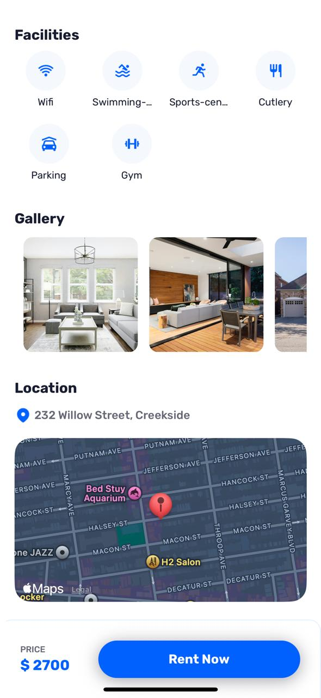
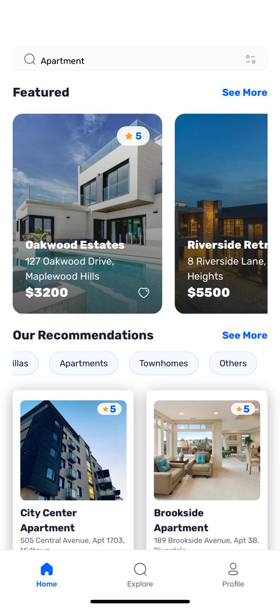

# Scout Mobile App

<p align="center">
  
</p>

A modern, feature-rich property search and management application built with React Native, TypeScript, and Appwrite. The app allows users to browse, filter, and view detailed information about various properties, including maps, reviews, and more.

## 🚀 Features

- **Home Screen**
  - Featured properties carousel
  - Personalized property recommendations

- **Explore Interface**
  - Advanced search with real-time filtering
  - Interactive map integration
  - Customizable search parameters

- **Property Details**
  - High-resolution image galleries
  - Comprehensive property information
  - Interactive location maps
  - Verified user reviews and ratings
  - Agent contact information

- **User Profiles**
  - Personalized user settings
  - Account management options

## 💻 Tech Stack

- **Framework**: React Native with TypeScript
- **Development Platform**: Expo
- **Styling**: Tailwind CSS (via React Native Tailwind)
- **Backend & Authentication**: Appwrite
- **Map Integration**: React Native Maps

## 📁 Project Structure

```
/
├── app/                 # Main application code
│   ├── (root)/          # Screen components
│   ├── _layout.tsx      # Navigation configuration
│   └── sign-in.tsx      # Sign In Page
├── components/          # Reusable UI components
├── constants/           # Application constants
├── lib/                 # Utility functions and services
├── assets/              # Static assets
│   ├── images/          # Application images
│   ├── icons/           # Custom icons
│   └── fonts/           # Custom fonts
└── .env.local           # Environment variables
```

## 🛠️ Installation

1. Clone the repository:
```bash
git clone https://github.com/rr789451/scout.git
cd scout
```

2. Install dependencies:
```bash
npm install
```

3. Set up environment variables:
```bash
cp .env.local
```

4. Configure the following environment variables:
```env
EXPO_PUBLIC_APPWRITE_PROJECT_ID=
EXPO_PUBLIC_APPWRITE_ENDPOINT=
EXPO_PUBLIC_APPWRITE_DATABASE_ID=
EXPO_PUBLIC_APPWRITE_AGENTS_COLLECTION_ID=
EXPO_PUBLIC_APPWRITE_GALLERIES_COLLECTION_ID=
EXPO_PUBLIC_APPWRITE_REVIEWS_COLLECTION_ID=
EXPO_PUBLIC_APPWRITE_PROPERTIES_COLLECTION_ID=
```

5. Start the development server:
```bash
npx expo start
```

## 🔑 Authentication

The application uses Appwrite for authentication. Ensure you have set up the following:

- Create an Appwrite project
- Configure authentication methods (Google OAuth provider)
- Set up the necessary collections in Appwrite Console
- Update the environment variables with your Appwrite credentials

## 💾 Database Schema

### Properties Collection
```typescript
interface Properties {
  name: string;
  type: enum;
  description: string;
  price: number;
  address: string;
  area: number
  bedrooms: number;
  bathrooms: number;
  rating: number;
  facilities: enum;
  image: url;
  geolocation: string;
}
```

### Galleries Collection
```typescript
interface Galleries {
  image: url
}
```

### Reviews Collection
```typescript
interface Reviews {
  name: string;
  avatar: url;
  rating: number;
  review: string;
}
```

### Agents Collection
```typescript
interface Agents {
  name: string;
  email: email;
  avatar: url;
}
```

## 👥 User Roles

### Regular Users
- Browse and search properties
- View detailed property information

### Agents
- Manage property listings
- Update property information

## 📱 Screen Flows

### Main Navigation
- Home (Featured & Recommendations)
- Explore (Search & Filters)
- Profile (Settings)

### Property Discovery Flow
1. Browse featured properties on Home screen
2. Use search and filters on Explore screen
3. View property details
4. Contact agent

### User Profile Flow
1. Access profile settings
2. Manage account information

## 🚀 Development

### Running on Simulator/Emulator
```bash
# iOS
npx expo run:ios

# Android
npx expo run:android
```

### Building for Production
```bash
# Create a production build
eas build --platform all

# Preview production build
eas build:run
```

## 📸 Screenshots

<div align="center">
  <div style="display: flex; flex-wrap: wrap; justify-content: center; gap: 20px; margin-bottom: 20px;">
    
    
    
  </div>
  <div style="display: flex; flex-wrap: wrap; justify-content: center; gap: 20px;">
    
    
    
  </div>
</div>

## 🔮 Future Enhancements

### Phase 2 Development Roadmap

1. **Dual Authentication System**
   - Separate login flows for property agents and regular users
   - Agent-specific dashboard and listing management

2. **Advanced Filtering System**
   - More granular search parameters
   - Save and load custom filter configurations

3. **Payment Integration**
   - Secure payment processing for property bookings
   - Multiple payment method support
   - Booking deposit functionality
   - Payment history and receipts


## 🤝 Contributing

- Fork the repository
- Create a feature branch
```bash
git checkout -b feature/YourFeature
```
- Commit changes
```bash
git commit -m 'Add some feature'
```
- Push to the branch
```bash
git push origin feature/YourFeature
```
- Open a Pull Request

## 📝 License

This project is licensed under the [MIT License](LICENSE).

## 🆘 Support

For support, please:
- Open an issue in the GitHub repository
- Contact me at [Rohit](mailto:rr789451@gmail.com)

## ✨ Acknowledgments

Built with the following amazing technologies:

[](https://reactnative.dev/)
[](https://www.typescriptlang.org/)
[](https://expo.dev/)
[](https://tailwindcss.com/)
[](https://appwrite.io/)
